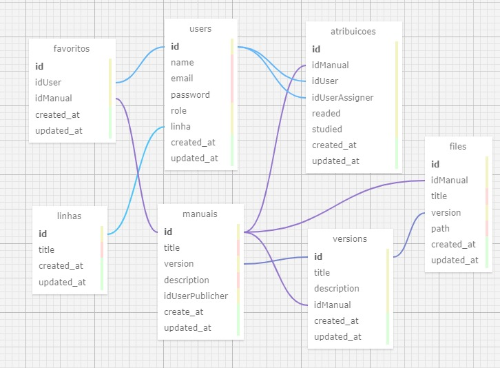

# Modelagem do banco de dados

Nesta modelagem do banco de dados podemos observar as entidades e suas relações, neste banco foram modelados as seguintes tabelas para o projeto da Dell: users (tabela de usuários); manuais (tabela dos manuais); linhas (tabela das linhas de montagem da Dell); favoritos (tabela para guardar os manuais favoritados pelo usuário); atribuições (tabela para guardar as tarefas atribuidas para o funcionário); versions (tabela para guardar todos os versionamentos dos manuais); files (tabela para aramzenar os arquivos);

Podemos observar que este banco de dados possui diversas relações, agora explicando todas as relações, temos as seguintes relações nesta modelagem:

**users - manuais: 1 - N** (Relação para atribuir o id do usuário que publicou o manual)

**users - manuais (atribuicoes): N - N** (Relação para guardar as atribuições dos manuais a fazer ao usuário, por ser uma relação N - N precisamos de uma tabela intermediaria (atribuicoes))

**users - manuais (favoritos): N - N** (Relação para guardar os manuais que foram favoritados pelo usuário, por ser uma relação N - N precisamos de uma tabela intermediaria (favoritos))

**user - linhas: 1 - N** (Relaciona a linha em que o funcionário trabalha na tabela users)

**manuais - versions: 1 - N** (Relacionar cada manual com a sua versão atual, onde os versionamentos passados são armazenados na tabela versions)

**version - files: 1 - N** (Relacionar a versão do manual com os arquivos, dessa forma aramazenando o histórico dos arquivos nas respectivas versões do manual)
